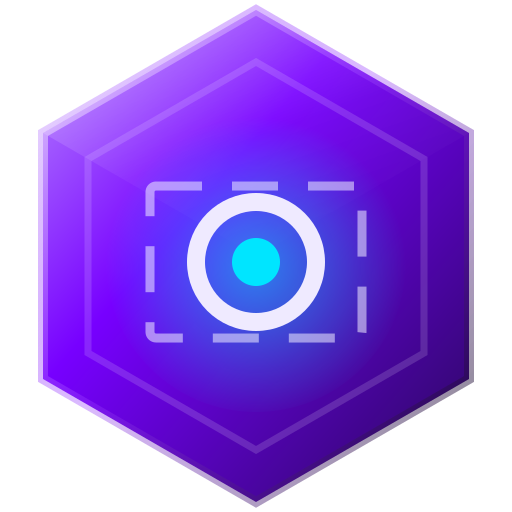
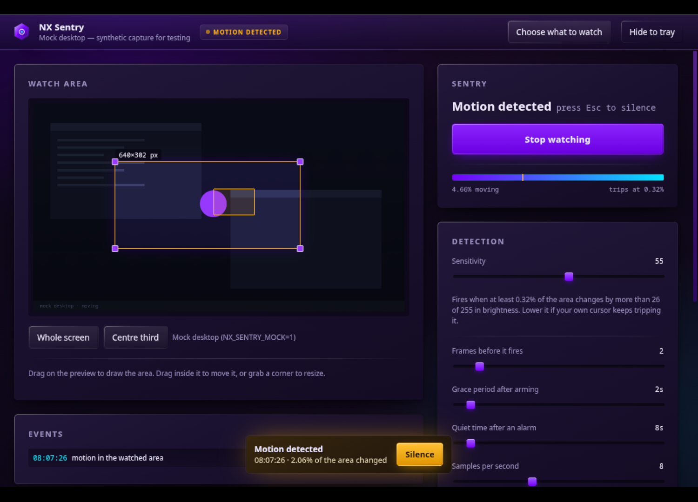
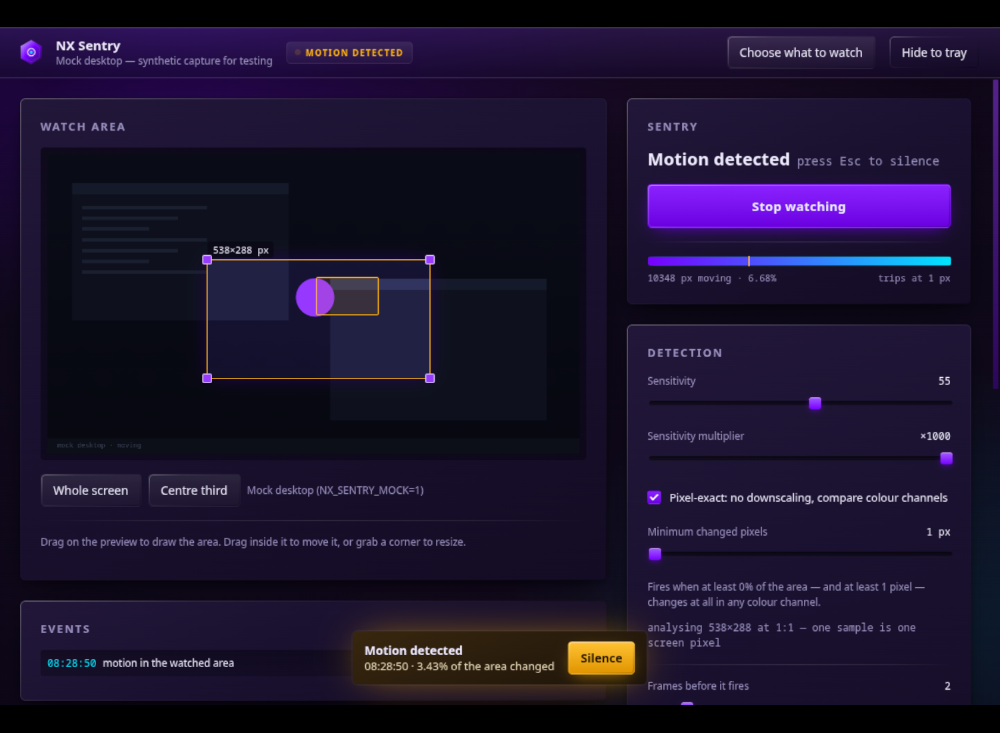

<div align="center">
  
  <h1>NX Sentry</h1>
  <p><b>Draw a rectangle on your screen. Get an alarm when something moves inside it.</b></p>
</div>

---

Some things are worth watching but not worth staring at: a door in a camera
feed, a render that finally finishes, a queue that starts moving, a chat window
in a game you alt-tabbed away from. NX Sentry watches the rectangle for you and
makes a noise when the pixels in it change.



*Shown running against the built-in mock desktop, the synthetic source the test
harness uses.*



*Pixel-exact at ×1000: the region analysed 1:1, tripping at a single changed
pixel.*

## What it does

- **Watch any part of any screen or window.** Pick a source, drag a rectangle
  over the preview, done. The rest of the screen is ignored entirely.
- **Sound an alarm when it moves.** Four synthesised alarms — siren, beep,
  pulse, chime — with a volume you control, plus an optional desktop
  notification and a taskbar flash.
- **Play it where you are listening.** Pick the output device the alarm uses,
  independently of the system default — the alarm can go to your speakers while
  a game holds your headset, or into the effects sink your desktop actually
  routes through. **Sound check** plays a bar, measures what left the audio
  graph, and names the device it went to.
- **Select small things precisely.** Zoom the preview up to 16×, watch a
  pixel-exact magnifier while you drag, and nudge the rectangle a single screen
  pixel at a time with the arrow keys.
- **Watch literal pixels when you need to.** A sensitivity multiplier up to
  ×1000 takes the thresholds down to "any change at all", and pixel-exact mode
  drops the downscaling entirely — the region is analysed 1:1 and compared
  channel by channel, so a single pixel changing colour is a trigger.
- **Not scream at every flicker.** A grace period after arming, a
  frames-in-a-row requirement before it fires, and a quiet time after each
  alarm, so a compression artefact or your own mouse leaving the room does not
  set it off.
- **Stay out of the way.** Close the window and it keeps watching from the
  tray. The tray icon and menu carry the state.
- **Show its work.** A live meter of how much of the area is moving against the
  threshold that would trip it, a marker on the preview showing what moved, and
  a timestamped log of every trigger.

## Install

Grab the AppImage from [Releases](https://github.com/nerdrx/nx-sentry/releases),
or let [NX Hub](https://github.com/nerdrx/nx-hub) install and update it with the
rest of the NX family.

From source:

```bash
git clone https://github.com/nerdrx/nx-sentry && cd nx-sentry && npm install && npm start
```

## Using it

1. **Choose what to watch** — a screen or a single window. On Wayland your
   desktop asks again, in its own dialog; that second dialog is the one that
   actually grants the capture.
2. **Drag a rectangle** on the preview. Drag inside it to move it, grab a corner
   to resize, or use *Whole screen* / *Centre third*.
3. **Start watching.** You get a grace period (3 seconds by default) to get your
   hands off the mouse, then the sentry is live.

For a small target — a status dot, a single row, a health bar — zoom in with
`Ctrl`+scroll (or the `+` button), pan by dragging with the middle mouse button,
and watch the magnifier that follows the cursor: it shows the source frame's
real pixels at 10× with a crosshair on the exact pixel under the pointer. Arrow
keys move the rectangle one screen pixel at a time, `Shift`+arrows resize its
far edge, and `Alt` makes either jump ten.

`Space` arms and disarms, `Esc` silences a sounding alarm, and the tray menu can
do both without opening the window.

### Tuning it

| Setting | What it changes |
| --- | --- |
| **Sensitivity** | Both thresholds at once: how much a pixel's brightness must change, and how much of the area must change with it. At 0 it wants a person walking past; at 100 a cursor twitch will do it. |
| **Sensitivity multiplier** | Divides both thresholds by ×1 to ×1000, geometrically. Past roughly ×8 the brightness threshold reaches zero — a change of one unit counts — and the area threshold falls below a single pixel of any realistic region. |
| **Pixel-exact** | Analyses the region at 1:1 instead of a 192px thumbnail, and compares colour channels instead of brightness. Both halves matter: a downscale averages one changed pixel into its neighbours, and greyscale maps different colours onto the same luma, so a pixel that changes colour without changing brightness is invisible without this. Cost is linear in the region's area (5.8ms per sample at 1080p), so it is capped at 4 megapixels and says so when a region exceeds that. The panel shows the measured cost per sample and warns when a sample no longer fits inside its own interval. |
| **Minimum changed pixels** | An absolute floor ANDed with the area threshold — what stops a boosted, pixel-exact setup from firing on one stray pixel of video noise. At 1 it is a no-op. |
| **Frames before it fires** | How many consecutive samples must be over the threshold. Two is enough to reject codec noise; raise it if a video is playing next to the area you care about. |
| **Grace period** | Motion during this window after arming is ignored — it is you leaving. |
| **Quiet time** | How long the sentry stays silent after an alarm before it can fire again. |
| **Samples per second** | 8/s is plenty and costs almost nothing. Raise it for fast motion, lower it on a laptop battery. |

### If you cannot hear the alarm

Press **Sound check** in the Alarm panel. It plays one bar, measures what
actually came out of the audio graph, and names the device it went to, which
separates the three silent failures: a suspended audio engine (click the window
once), a graph producing no signal (raise the volume, check the app's level in
the system mixer), or sound that is working and going somewhere you are not
listening.

That last one is the common case on Linux, and it is not a bug in either place:
if your desktop routes what you hear through an effects sink (EasyEffects,
Carla, a virtual mixer) while the *system default* output is the raw device,
every app that just opens the default plays where you cannot hear it. Choose
that sink under **Play the alarm on**, and the alarm follows you rather than the
default.

The app also warns you the moment an alarm fires while its audio engine cannot
sound, rather than looking like it is watching when it has gone mute.

If your own mouse pointer keeps tripping it, the capture includes the cursor:
either lower the sensitivity, or draw the area somewhere the pointer does not go.

## How the detection works

Each sample draws **only the watched rectangle** into a small offscreen canvas
(192px on the long edge), converts it to grayscale, and compares it with the
previous sample. A pixel counts as moving when its brightness changed by more
than the sensitivity's threshold; the count of moving pixels — and the fraction
of the region they make up — is the one measurement the whole UI is a view of.
When it stays over both thresholds for N consecutive samples, the alarm fires.

In **pixel-exact** mode the thumbnail step is skipped: the region is drawn at
1:1 and the comparison runs over the raw RGBA channels, where a threshold of
zero means one unit of difference in one channel of one pixel is a trigger. The
meter reads in pixels as well as percent, because at a high multiplier the
percentage is all zeroes and the only readable number is how many pixels moved.

That is the entire algorithm, and it lives in
[`src/renderer/detector.js`](src/renderer/detector.js) as pure functions over
typed arrays — no DOM, no canvas — so `npm test` exercises exactly the code that
runs in the app.

Nothing leaves the machine. There is no recording, no upload, no network code in
this app at all; frames are compared and thrown away.

## Platform notes

- **Linux / Wayland** — capture goes through `xdg-desktop-portal` and PipeWire,
  so the compositor decides what NX Sentry may see and can revoke it at any
  time. If the share ends, the sentry disarms itself and says so rather than
  pretending to watch a dead stream.
- **Linux / X11 and Windows** — the same code path via Chromium's desktop
  capturer; no portal dialog on X11.
- Global hotkeys are deliberately not used: they do not work on Wayland, and a
  shortcut that silently fails is worse than none. The tray menu covers it.

## Settings

Everything is stored in `~/.config/nx-sentry/settings.json` (override the
directory with `NX_SENTRY_CONFIG_DIR`, which is what the tests do so they can
never touch a real install's settings).

## Development

```bash
npm install      # electron 40
npm test         # detector + settings, headless
npm start        # run it
npm run headless # run inside a nested headless compositor and screenshot it
```

Two environment switches make the app testable without a real screen:

- `NX_SENTRY_MOCK=1` — replace the capture with a synthetic desktop that has
  something moving in it on a 7-second cycle.
- `NX_SENTRY_AUTOARM=1` — arm as soon as that mock source starts, so a headless
  screenshot can catch the live states.

`NX_SENTRY_CONFIG_DIR` redirects Electron's own `userData` as well as
`settings.json`, so a test run cannot take the single-instance lock from — or
raise the window of — the copy you have installed.

```bash
NX_SENTRY_MOCK=1 NX_SENTRY_AUTOARM=1 npm run headless
```

## Design

NX Sentry follows the [NX design language](https://github.com/nerdrx/nx-hub/blob/main/docs/DESIGN.md)
— liquid glass on deep space. Tokens are copied verbatim into
[`src/renderer/tokens.css`](src/renderer/tokens.css); structural surfaces are
opaque elevation steps, real blur is spent only on the header, the source sheet
and the alarm banner, and the card sheen tracks the pointer rather than sweeping
on hover. Violet leads, cyan is the live motion value inside the meter, amber
means "something moved", and red is kept for genuine failures.

## License

MIT — see [LICENSE](LICENSE).
